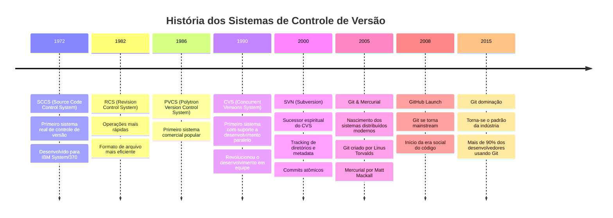

# História do Controle de Versão

## A Evolução do Versionamento
> Como passamos de backups manuais para sistemas distribuídos modernos



## A Linha do Tempo Detalhada

### Anos 70-80: A Pré-História do Código

#### SCCS (1972)
- **Criador**: Marc Rochkind na Bell Labs
- **Inovações**:
  - Primeiro sistema real de controle de versão
  - Introduziu o conceito de deltas reversos
  - Arquivos de histórico com extensão ,v
- **Limitações**:
  - Apenas um arquivo por vez
  - Sem networking
  - Unix only
```ascii
SCCS
|-- arquivo,v
|-- histórico
`-- locks
```

#### RCS (1982)
- **Criador**: Walter F. Tichy
- **Melhorias**:
  - Sistema de branching primitivo
  - Melhor performance
  - Formato de arquivo mais eficiente
  - Comandos mais intuitivos
- **Ainda usado para**:
  - Controle de configuração
  - Documentação
  - Projetos simples

### Anos 90: A Revolução Centralizada

#### CVS (1990)
- **Criador**: Dick Grune
- **Revolucionou com**:
  - Desenvolvimento paralelo
  - Operações em rede
  - Repositórios compartilhados
  - Tags e branches
- **Problemas famosos**:
  - Commits não atômicos
  - Renomeação de arquivos complicada
  - Bugs de merge

```ascii
    CVS Server
    /    |    \
Client Client Client
```

#### SVN (2000)
- **Criador**: CollabNet
- **Avanços**:
  - Commits verdadeiramente atômicos
  - Melhor handling de binários
  - Renomeação e move de arquivos
  - Metadados versionados
- **Ainda popular em**:
  - Empresas tradicionais
  - Projetos com muitos binários
  - Sistemas legados

### Anos 2000+: A Era Distribuída

#### Git (2005)
- **Criador**: Linus Torvalds
- **Motivação**: 
  - BitKeeper removeu licença gratuita do kernel Linux
  - Necessidade de sistema rápido e distribuído
- **Inovações**:
  - Modelo distribuído
  - Branching super leve
  - Staging area
  - Integridade criptográfica
- **Por que dominou**:
  - Performance excepcional
  - GitHub e social coding
  - Flexibilidade extrema
  - Workflow distribuído

```ascii
Git Flow
main
 |\
 | feature
 |/
 |\
 | hotfix
 |/
```

#### Mercurial (2005)
- **Criador**: Matt Mackall
- **Diferencias**:
  - Interface mais amigável
  - Curva de aprendizado menor
  - Extensibilidade via Python
- **Usado por**:
  - Facebook
  - Mozilla
  - Google (parcialmente)

### Anos 2010+: A Era Social

#### GitHub (2008)
- Transformou Git em plataforma social
- Pull Requests revolucionaram code review
- Actions trouxeram CI/CD integrado
- Copilot iniciou era da IA no código

#### GitLab (2011)
- Alternativa self-hosted ao GitHub
- CI/CD integrado desde o início
- DevOps como plataforma

## Lições da História

### O que Aprendemos
1. **Evolução Constante**
   - De single-file para repositórios completos
   - De local para distribuído
   - De linha de comando para interfaces gráficas

2. **Padrões que Permaneceram**
   - Importância do histórico
   - Necessidade de branches
   - Valor da colaboração

3. **Tendências Futuras**
   - Integração com IA
   - Automação crescente
   - Colaboração em tempo real

## Conclusão
A história dos sistemas de controle de versão é uma jornada fascinante de evolução tecnológica. De simples backups numerados até sistemas distribuídos com IA, cada era trouxe suas inovações e aprendizados. Como diria a mãe do Stifler: "As festas podem mudar, mas a diversão continua a mesma!" 

E lembre-se: conhecer a história nos ajuda a entender melhor as ferramentas que usamos hoje e apreciar como chegamos até aqui. Afinal, se hoje podemos fazer um git push sem pensar duas vezes, é porque muita gente quebrou a cabeça com SCCS e CVS antes!