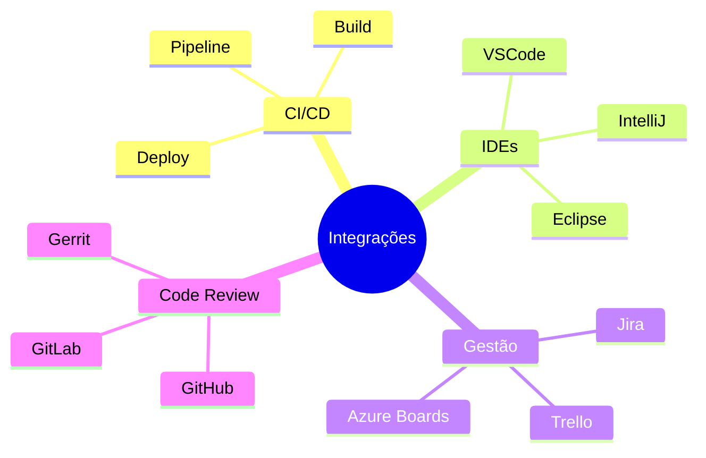
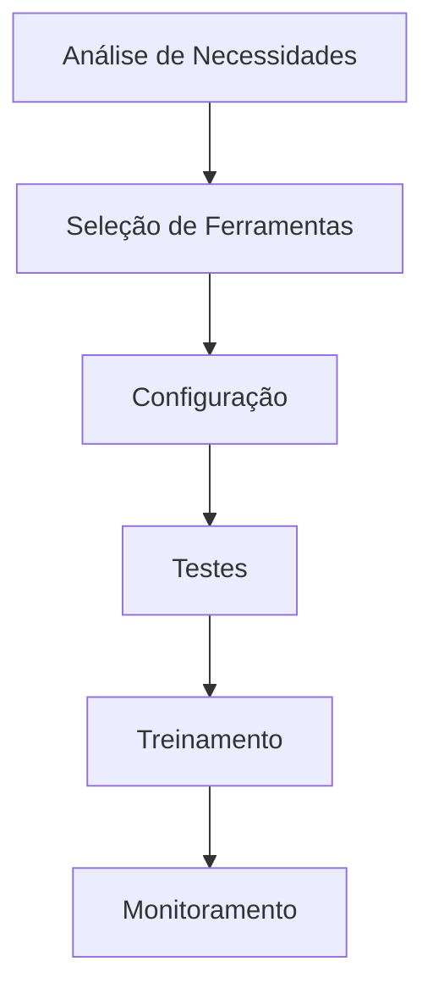

# Integração do Controle de Versão

A integração do controle de versão com outras ferramentas e sistemas é fundamental para um fluxo de trabalho moderno e eficiente.

## Visão Geral

## Benefícios Principais

### 1. Automação
- Redução de tarefas manuais
- Menor probabilidade de erros
- Processos padronizados

### 2. Produtividade
- Fluxo de trabalho otimizado
- Ferramentas integradas
- Contexto unificado

### 3. Qualidade
- Verificações automáticas
- Feedback rápido
- Rastreabilidade

## Áreas de Integração

Explore cada área específica:

- [Integração com CI/CD](ci-cd-integration.md)
- [Integração com IDEs](ide-integration.md)
- [Integração com Gestão de Projetos](project-management-integration.md)
- [Ferramentas de Code Review](code-review-tools.md)

## Melhores Práticas

### Implementação

### Manutenção
1. Atualize regularmente
2. Monitore integrações
3. Colete feedback
4. Otimize workflows
5. Documente processos