# Segurança em Controle de Versão

## Fundamentos de Segurança

### Princípios Básicos
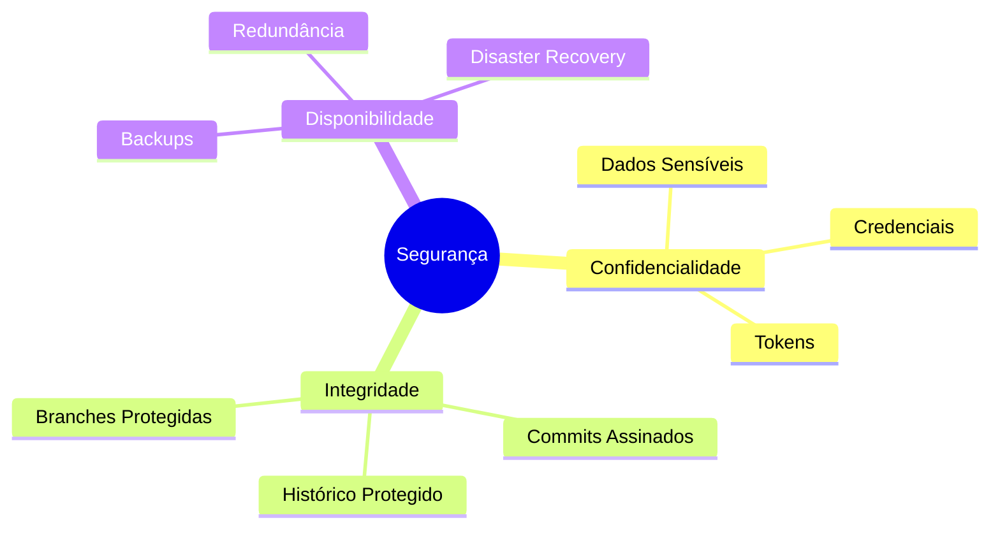

## Proteção de Dados Sensíveis

### Gerenciamento de Credenciais
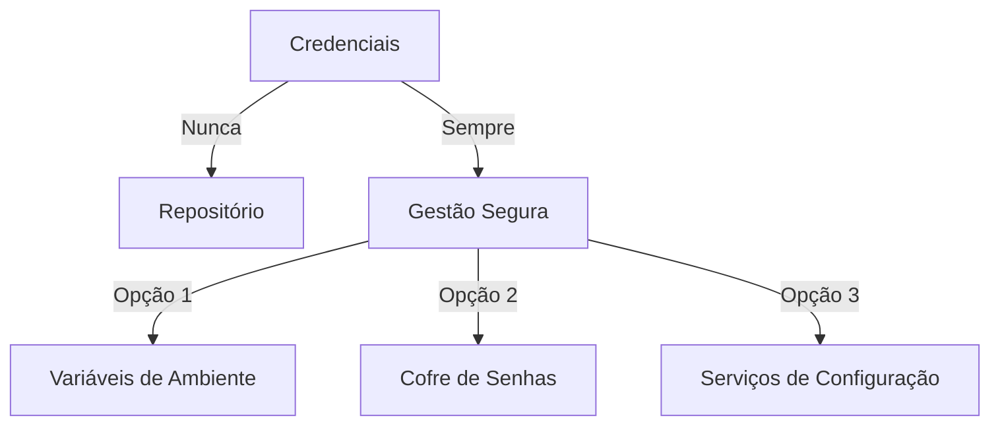

### Arquivo .gitignore Robusto
```gitignore
# Arquivos de Configuração
.env
.env.*
config/*.json
secrets.yaml
credentials.ini

# Chaves e Certificados
*.pem
*.key
*.cert
*.crt
id_rsa*
*.ppk

# Diretórios Sensíveis
.ssh/
private/
secrets/
credentials/

# Logs e Temporários
*.log
tmp/
temp/
.cache/

# IDEs e Editores
.vscode/
.idea/
*.swp
*.swo

# Dependências e Builds
node_modules/
vendor/
dist/
build/
```

## Controle de Acesso

### Modelo de Permissões
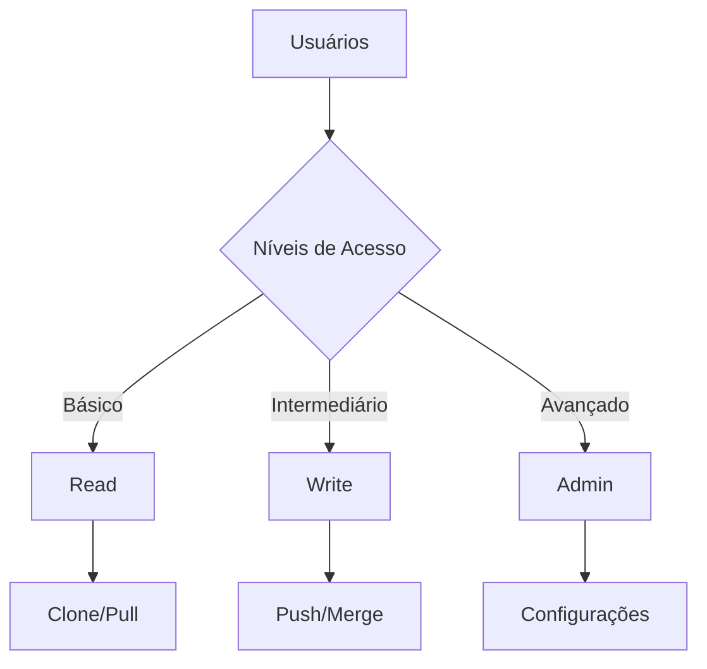

### Autenticação e Autorização

#### Métodos de Autenticação
1. **SSH**
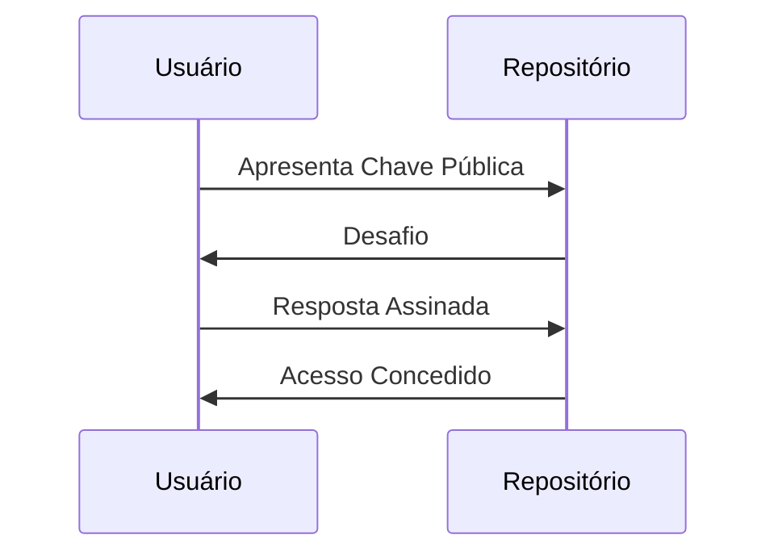

2. **Tokens de Acesso**
- Tokens de curta duração
- Escopos limitados
- Revogação simples
- Auditoria facilitada

3. **2FA/MFA**
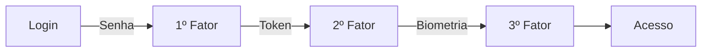

## Proteção de Branches

### Regras de Proteção
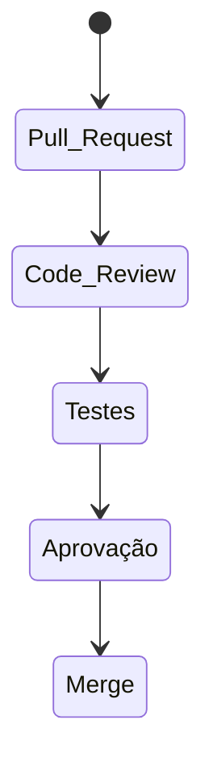

### Configurações Recomendadas
1. **Branch Principal**
   - Requer aprovações
   - Proíbe force push
   - Exige status checks
   - Mantém histórico linear

2. **Branches de Feature**
   - Nomenclatura padronizada
   - Vida útil limitada
   - Merge apenas via PR
   - Testes automatizados

## Monitoramento e Auditoria

### Logs de Segurança
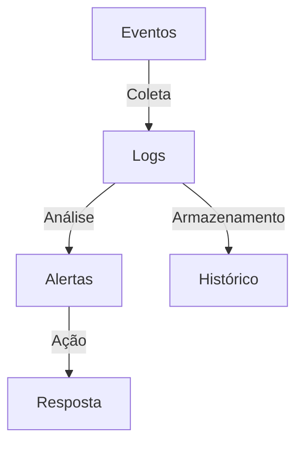

### Métricas de Segurança
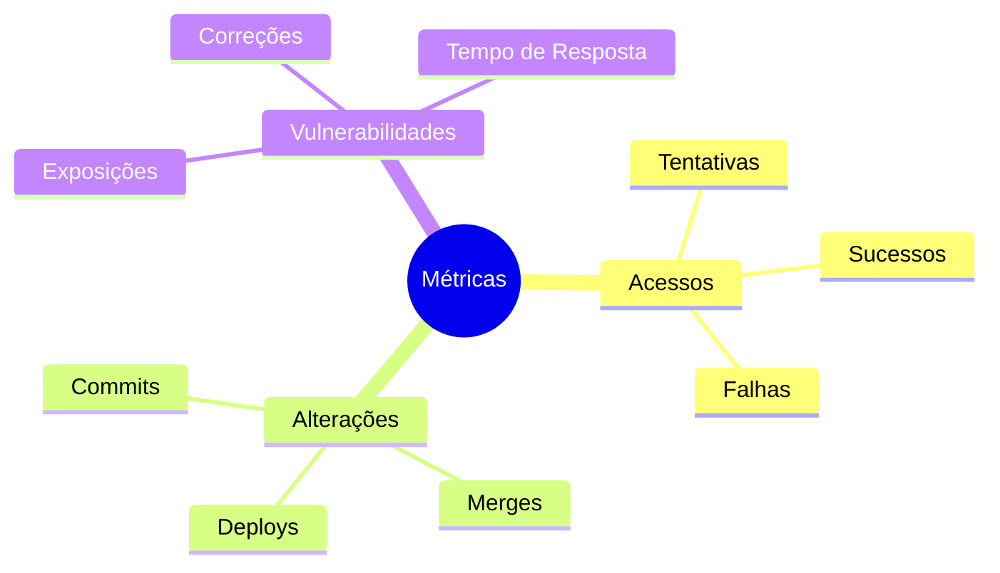

## Vulnerabilidades Comuns

### Tipos de Ameaças
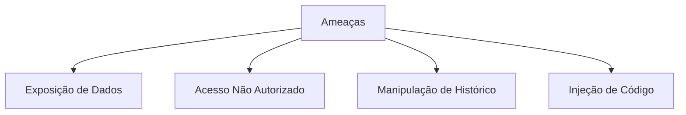

### Mitigação
1. **Ferramentas de Análise**
   - Git-secrets
   - TruffleHog
   - GitGuardian
   - Gitleaks

2. **Hooks de Prevenção**
```bash
#!/bin/sh
# pre-commit hook para detectar secrets
if git-secrets --scan; then
    exit 0
else
    echo "Secrets detectados! Commit bloqueado."
    exit 1
fi
```

## Backup e Recuperação

### Estratégias de Backup
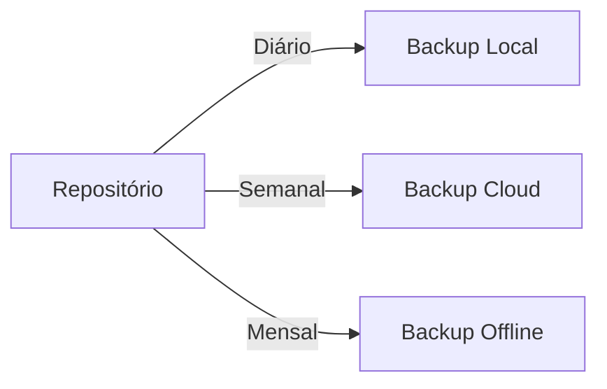

### Plano de Recuperação
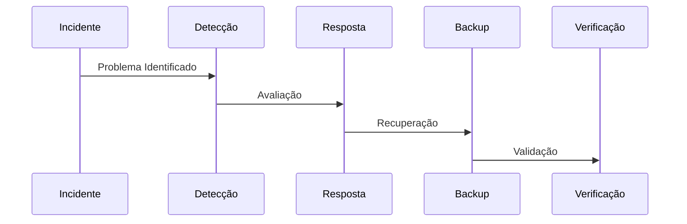

## Melhores Práticas

### Checklist de Segurança
1. **Repositório**
   - [ ] .gitignore atualizado
   - [ ] Branches protegidas
   - [ ] Hooks configurados
   - [ ] Backups automatizados

2. **Acesso**
   - [ ] 2FA habilitado
   - [ ] Tokens com escopo mínimo
   - [ ] Revisão regular de acessos
   - [ ] Logs de auditoria

3. **Código**
   - [ ] Análise de secrets
   - [ ] Verificação de dependências
   - [ ] Assinatura de commits
   - [ ] Code review obrigatório

### Automação de Segurança
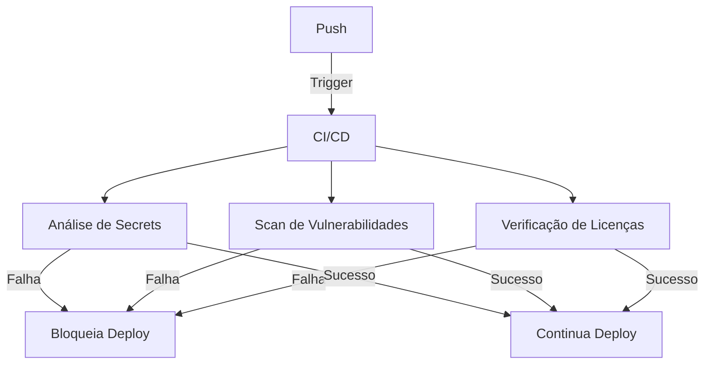

## Resposta a Incidentes

### Plano de Ação
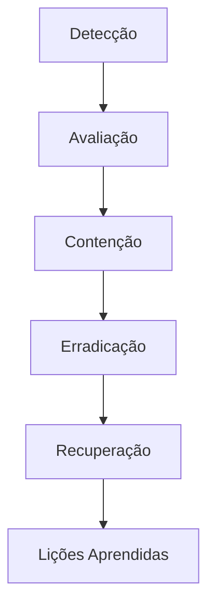

### Documentação
1. **Registro de Incidentes**
   - Data e hora
   - Tipo de incidente
   - Impacto
   - Ações tomadas
   - Resolução

2. **Análise Post-mortem**
   - Causa raiz
   - Medidas preventivas
   - Melhorias necessárias
   - Atualizações de processo
