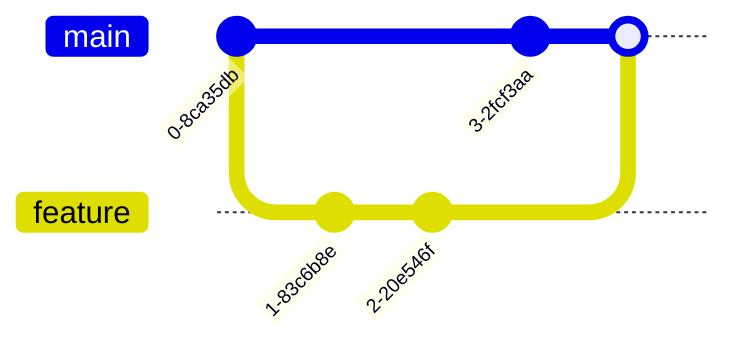

# Terminologia do Controle de Versão

## Conceitos Fundamentais

### Repository (Repositório)


- Local onde o código é armazenado
- Contém todo o histórico do projeto
- Pode ser local ou remoto
- Inclui metadados e configurações

### Branch (Ramo)


- Linha independente de desenvolvimento
- Permite trabalho paralelo
- Isola mudanças em desenvolvimento
- Facilita experimentações

### Commit (Confirmação)


- Snapshot do código em um momento
- Inclui mensagem descritiva
- Possui identificador único (hash)
- Mantém autor e timestamp

## Operações Básicas

### Clone


- Cria cópia local do repositório
- Inclui todo histórico
- Configura remote origin
- Estabelece tracking branches

### Pull


- Atualiza repositório local
- Combina fetch + merge
- Sincroniza com remoto
- Resolve conflitos se necessário

### Push


- Envia commits locais
- Atualiza repositório remoto
- Requer permissões
- Pode exigir resolução de conflitos

## Operações Avançadas

### Merge (Mesclagem)


- Combina mudanças de diferentes branches
- Pode gerar conflitos
- Mantém histórico de ambas as branches
- Cria commit de merge

### Rebase (Rebase)


- Reaplica commits sobre outra base
- Mantém histórico linear
- Útil para manter branches atualizadas
- Altera histórico de commits

### Cherry-pick


- Aplica commits específicos
- Seletivo e preciso
- Útil para hotfixes
- Cria novos commits

## Estados de Arquivos

### Tracked (Rastreado)


#### Modified (Modificado)
- Arquivo alterado
- Não preparado para commit
- Detectado pelo git status

#### Staged (Preparado)
- Marcado para commit
- Na área de staging
- Pronto para confirmação

#### Committed (Confirmado)
- Salvo no repositório
- Parte do histórico
- Possui hash único

### Untracked (Não Rastreado)


- Arquivos novos
- Não incluídos no controle de versão
- Precisam ser adicionados explicitamente
- Ignorados via .gitignore

## Glossário Expandido

| Termo | Definição | Uso Comum |
|------|-----------|-----------|
| Clone | Cópia completa do repositório | Início do trabalho |
| Fork | Cópia independente do repositório | Contribuição externa |
| Pull Request | Solicitação para integrar mudanças | Colaboração |
| Tag | Marco específico no histórico | Releases |
| Hook | Script automatizado em eventos | Automação |
| Remote | Repositório em servidor | Colaboração |
| Head | Ponteiro para commit atual | Referência |
| Index | Área de staging | Preparação |
| Stash | Armazenamento temporário | Mudança de contexto |
| Fetch | Download de mudanças | Atualização |

## Configurações e Metadados

### Arquivos de Configuração
```ascii
.git/
├── config
├── HEAD
├── index
├── objects/
└── refs/
```

### Arquivos Especiais
```ascii
projeto/
├── .gitignore
├── .gitattributes
├── .gitmodules
└── .git/
```

## Fluxos de Trabalho

### Básico


### Colaborativo


## Resolução de Problemas

### Conflitos


### Recuperação
