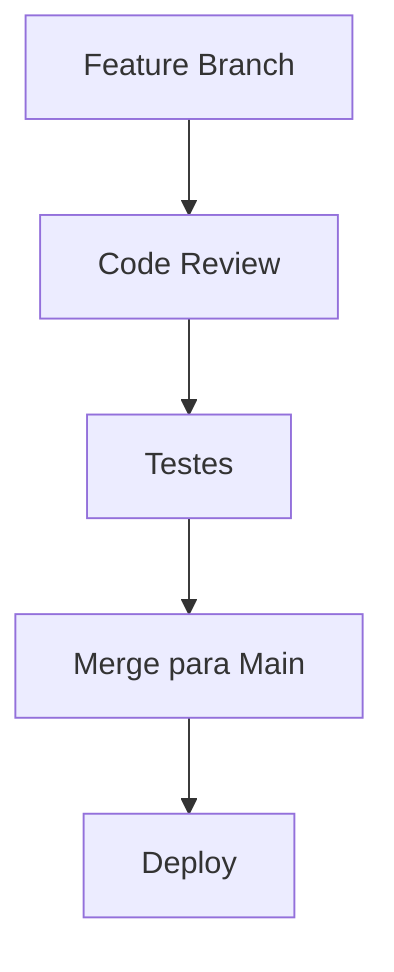

# Fluxos de Trabalho em Versionamento

## Modelos de Fluxo de Trabalho

### Trunk-Based Development
- Desenvolvimento direto na branch principal
- Integração contínua frequente
- Ideal para equipes pequenas e ágeis

### Feature Branch Workflow
- Branch separada para cada feature
- Merge através de pull requests
- Revisão de código facilitada

### Gitflow
- Branches específicas para features, releases e hotfixes
- Estrutura mais rigorosa
- Ideal para releases planejadas

### Forking Workflow
- Fork do repositório principal
- Comum em projetos open source
- Maior isolamento entre contribuições

## Escolhendo um Workflow

### Fatores a Considerar
- Tamanho da equipe
- Frequência de releases
- Complexidade do projeto
- Necessidades de QA

### Exemplos Práticos

## Boas Práticas
1. Commits frequentes e pequenos
2. Mensagens de commit claras
3. Code review regular
4. Testes antes do merge
5. Documentação atualizada

## Ferramentas de Suporte
- CI/CD pipelines
- Code review platforms
- Issue trackers
- Automação de testes