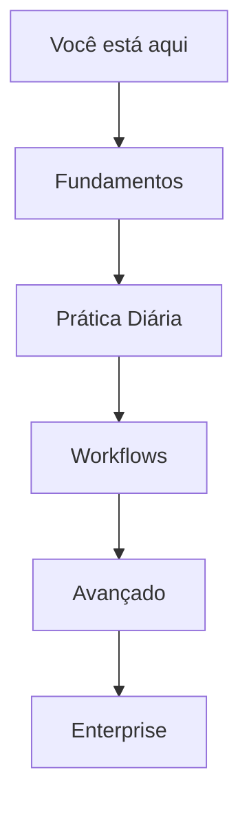
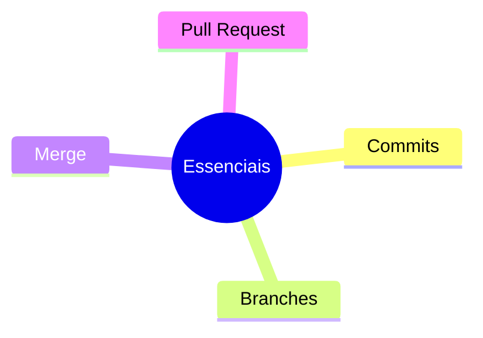

# Bem-vindo ao Git Pie 🥧

## O que é o Git Pie?

Git Pie é um guia completo sobre Git e controle de versão, criado especialmente para desenvolvedores brasileiros. Nossa proposta é ensinar Git de forma clara, objetiva e com uma pitada de humor.

## Como Usar esta Documentação

### Caminho Recomendado

### 1. Fundamentos First 🎯
Se você está começando:
- Conceitos Básicos do Git
- Instalação e Configuração
- Primeiros Comandos
- Ciclo de Vida do Git

### 2. Mão na Massa 💪
Aprenda o dia a dia:
- Commits e Boas Práticas
- Branches na Prática
- Resolução de Conflitos
- Code Review

### 3. Workflows na Vida Real 🌍
Escolha seu caminho:
- Trunk-Based Development
- Feature Branch
- Gitflow
- Forking Workflow

### 4. Nível Avançado 🚀
Para os ninjas do Git:
- Git Internals
- Hooks e Automação
- Recuperação com Reflog
- Submodules e Subtrees

### 5. Enterprise Ready 🏢
Escalando para times grandes:
- Governança
- Segurança
- Performance
- Métricas

## Highlights do Conteúdo

### Must-Know ⭐

### Quick Wins 🏃
- Comandos mais usados
- Fluxo básico de trabalho
- Resolução de conflitos simples
- Boas práticas de commit

### Power Features 💪
- Rebase interativo
- Cherry-pick
- Bisect
- Hooks

## Por Onde Começar?

### Iniciante Total
1. [Conceitos Básicos](git-basics.md)
2. [Instalação e Setup](installation-setup.md)
3. [Primeiros Passos](first-steps.md)

### Já Uso Git
1. [Boas Práticas de Commit](commit-conventions.md)
2. [Estratégias de Branch](branching-strategies.md)
3. [Workflows](workflow-automation.md)

### Nível Avançado
1. [Git Internals](git-internals.md)
2. [Performance](repo-optimization.md)
3. [Patterns Enterprise](enterprise-patterns.md)

## Recursos Adicionais

### Referência Rápida
- [Cheat Sheet](cheat-sheet.md)
- [Troubleshooting](git-troubleshooting.md)
- [Glossário](glossary.md)

### Ferramentas Recomendadas
- [Git Tools](git-tools.md)
- [CI/CD](ci-cd-integration.md)
- [Segurança](git-security-best-practices.md)

## Contribua!

Este é um projeto open source e suas contribuições são bem-vindas!
- Encontrou um erro?
- Tem uma sugestão?
- Quer adicionar conteúdo?

[Aprenda como contribuir](contributing.md)

---

> **Próximo Passo Recomendado**: Comece pelos [Conceitos Básicos](git-basics.md) para construir uma base sólida.