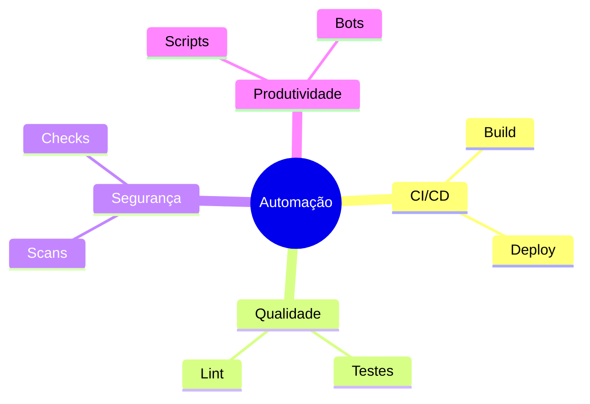
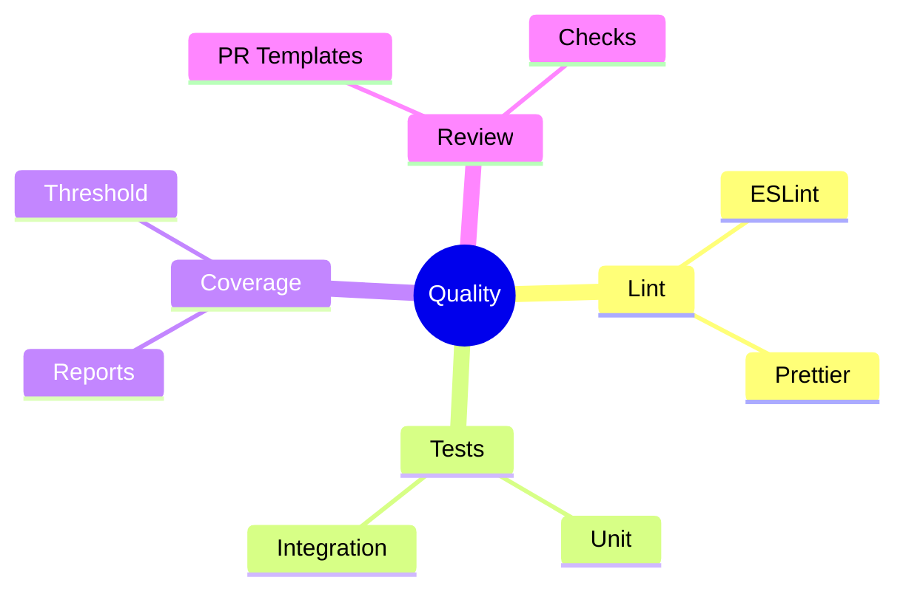
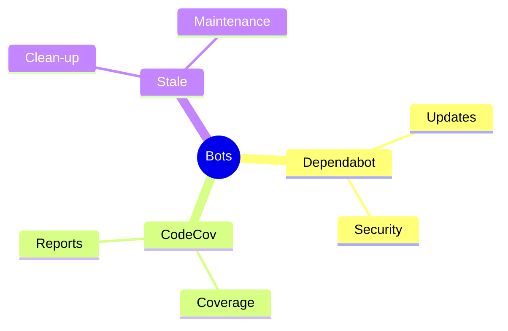
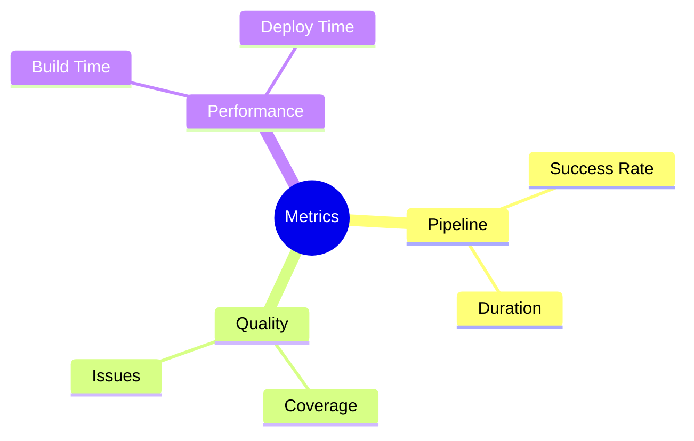
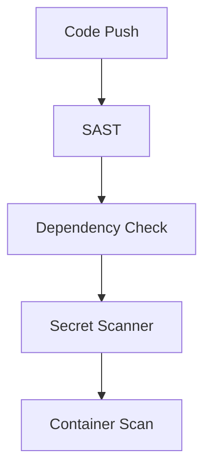
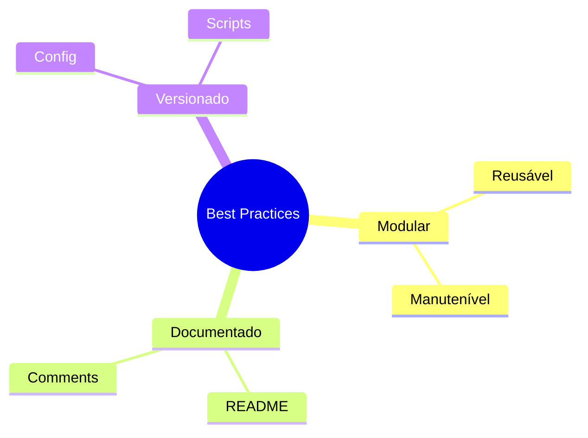
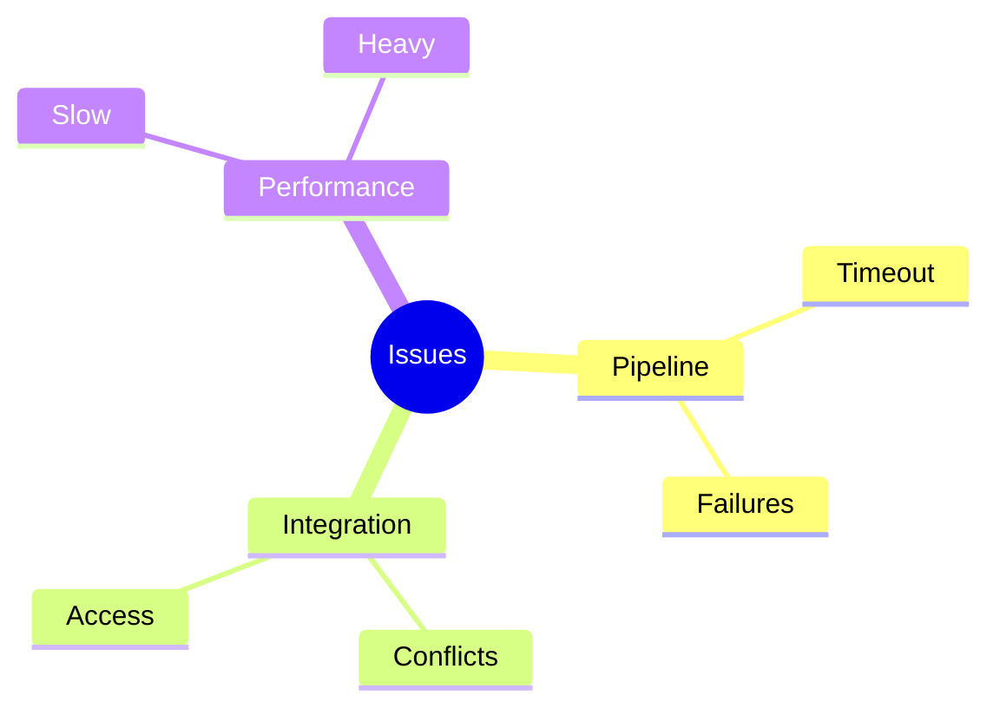
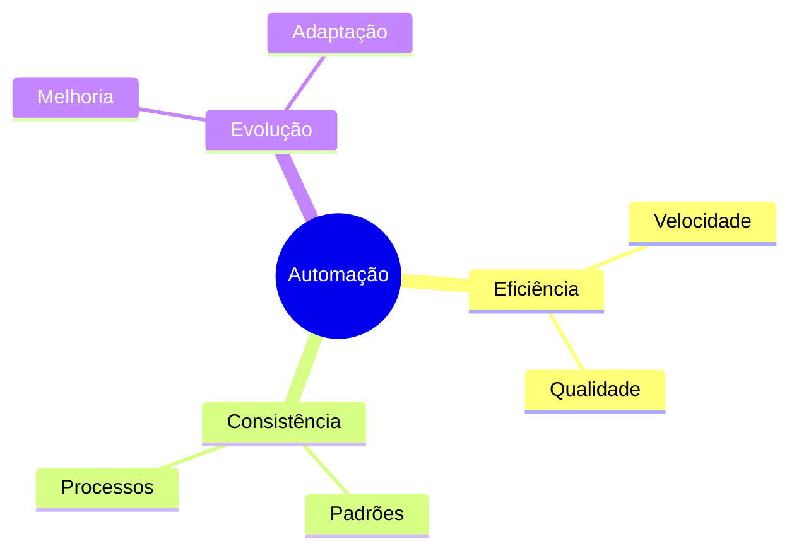

# Automação de Workflow

Como diria o Stifler: "Por que fazer manual o que a máquina pode fazer por você?" Vamos explorar como automatizar nosso workflow!

## Fundamentos da Automação

### 1. Pilares da Automação


### 2. Benefícios Principais
```ascii
🚀 Automation Benefits

Velocidade:
├── Build rápido
├── Deploy contínuo
└── Feedback imediato

Qualidade:
├── Testes automáticos
├── Code standards
└── Security checks

Consistência:
├── Processo padrão
├── Menos erros
└── Rastreabilidade
```

## Pipeline CI/CD

### 1. Estrutura Básica


### 2. Configuração GitHub Actions
```yaml
name: CI Pipeline
on:
  push:
    branches: [ main ]
  pull_request:
    branches: [ main ]

jobs:
  build:
    runs-on: ubuntu-latest
    steps:
      - uses: actions/checkout@v2
      - name: Build
        run: make build
      - name: Test
        run: make test
      - name: Lint
        run: make lint
```

## Automação de Qualidade

### 1. Code Quality Gates


### 2. Checklist Automático
```ascii
✅ Quality Checklist

Pre-commit:
├── Lint
├── Format
└── Tests

PR Creation:
├── Templates
├── Labels
└── Assignees

Merge Check:
├── Build
├── Coverage
└── Reviews
```

## Bots e Integrações

### 1. GitHub Apps Essenciais


### 2. Configuração de Bots
```yaml
# Dependabot config
version: 2
updates:
  - package-ecosystem: "npm"
    directory: "/"
    schedule:
      interval: "weekly"
    labels:
      - "dependencies"
      - "automerge"

# Stale config
staleLabel: "stale"
daysUntilStale: 60
daysUntilClose: 7
```

## Scripts de Automação

### 1. Scripts Úteis
```bash
#!/bin/bash

# Branch cleanup
cleanup() {
    git fetch -p
    git branch -vv | grep ': gone]' | awk '{print $1}' | xargs git branch -D
}

# Version bump
bump_version() {
    npm version $1
    git push && git push --tags
}
```

### 2. Hooks Git
```ascii
🎣 Git Hooks

pre-commit:
├── Lint
└── Format

pre-push:
├── Tests
└── Build

post-merge:
├── Install deps
└── Clean cache
```

## Monitoramento

### 1. Métricas Importantes


### 2. Dashboard
```ascii
📊 Automation Dashboard

Build Status:
├── Success Rate
├── Duration
└── Failures

Quality Gates:
├── Coverage
├── Issues
└── Debt

Performance:
├── Build Time
├── Deploy Time
└── Queue Time
```

## Segurança Automatizada

### 1. Security Checks


### 2. Security Pipeline
```ascii
🔒 Security Pipeline

Static Analysis:
├── SAST
└── Code Quality

Dependencies:
├── Audit
└── Updates

Secrets:
├── Scanner
└── Validator
```

## Melhores Práticas

### 1. Guidelines


### 2. Checklist de Implementação
```ascii
📋 Implementation Checklist

Setup:
├── CI/CD Pipeline
├── Quality Gates
└── Security Checks

Maintenance:
├── Monitor Metrics
├── Update Deps
└── Review Logs

Documentation:
├── Setup Guide
├── Troubleshooting
└── Best Practices
```

## Troubleshooting

### 1. Problemas Comuns


### 2. Debug Guide
```ascii
🔍 Debug Steps

Pipeline Issues:
├── Check Logs
├── Verify Config
└── Test Local

Integration Problems:
├── Check Access
├── Verify Tokens
└── Test Connection
```

## Conclusão

Como diria o Stifler: "Automatizar é como ter um amigo fazendo o trabalho chato enquanto você curte a festa!"



## Recursos Adicionais

### 1. Ferramentas Populares
```ascii
🛠️ Popular Tools

CI/CD:
├── GitHub Actions
├── Jenkins
└── GitLab CI

Quality:
├── SonarQube
├── ESLint
└── Jest

Security:
├── Snyk
├── OWASP
└── Dependabot
```

### 2. Links Úteis
```ascii
📚 Resources

Docs:
├── GitHub Actions
├── Jenkins
└── GitLab CI

Tutorials:
├── CI/CD Setup
├── Bot Config
└── Scripts
```