# Boas Práticas de Workflow

Como diria o pai do Jim: "Não importa a festa que você escolhe, o importante é não fazer besteira!"

## Princípios Fundamentais

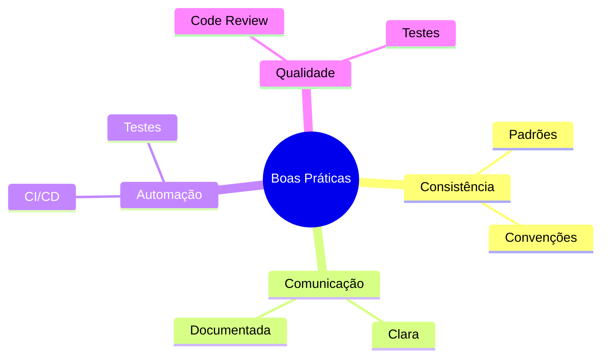

## Commits e Branches

### 1. Padrões de Commit
```ascii
✍️ Commit Message Structure

<tipo>(<escopo>): <mensagem>

tipos:
├── feat     (nova feature)
├── fix      (correção bug)
├── docs     (documentação)
├── style    (formatação)
├── refactor (refatoração)
├── test     (testes)
└── chore    (manutenção)
```

### 2. Organização de Branches
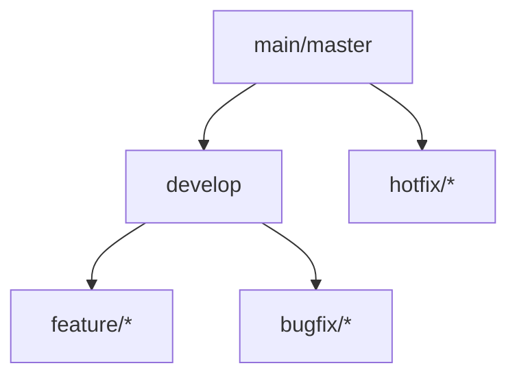

## Code Review

### 1. Checklist de Review
```ascii
📋 Review Checklist

Código:
├── Clean Code
├── SOLID
├── DRY
└── Performance

Qualidade:
├── Testes
├── Cobertura
└── Documentação

Segurança:
├── Vulnerabilidades
└── Boas práticas
```

### 2. Processo de Review
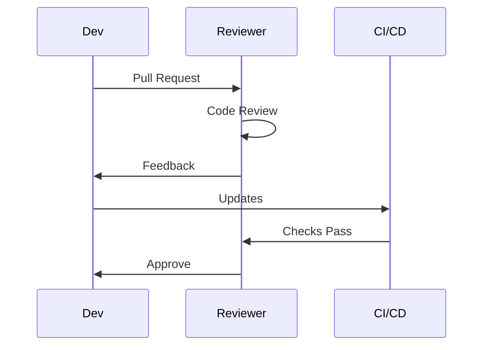

## Integração Contínua

### 1. Pipeline Básico
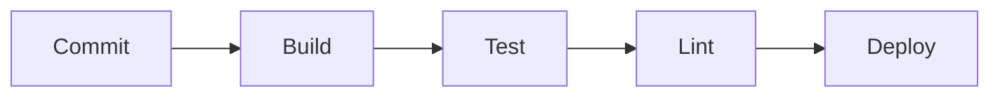

### 2. Checklist de CI
```ascii
🔄 CI Checklist

1. [ ] Build automatizado
2. [ ] Testes unitários
3. [ ] Testes integração
4. [ ] Análise estática
5. [ ] Security scan
6. [ ] Performance check
```

## Documentação

### 1. Estrutura Recomendada
```ascii
📚 Documentation Structure

projeto/
├── README.md
├── CONTRIBUTING.md
├── CHANGELOG.md
└── docs/
    ├── setup.md
    ├── workflow.md
    └── guidelines.md
```

### 2. Templates
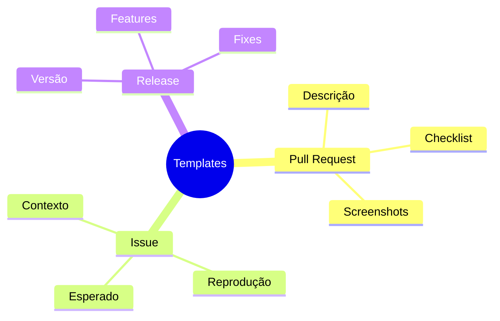

## Gestão de Releases

### 1. Versionamento
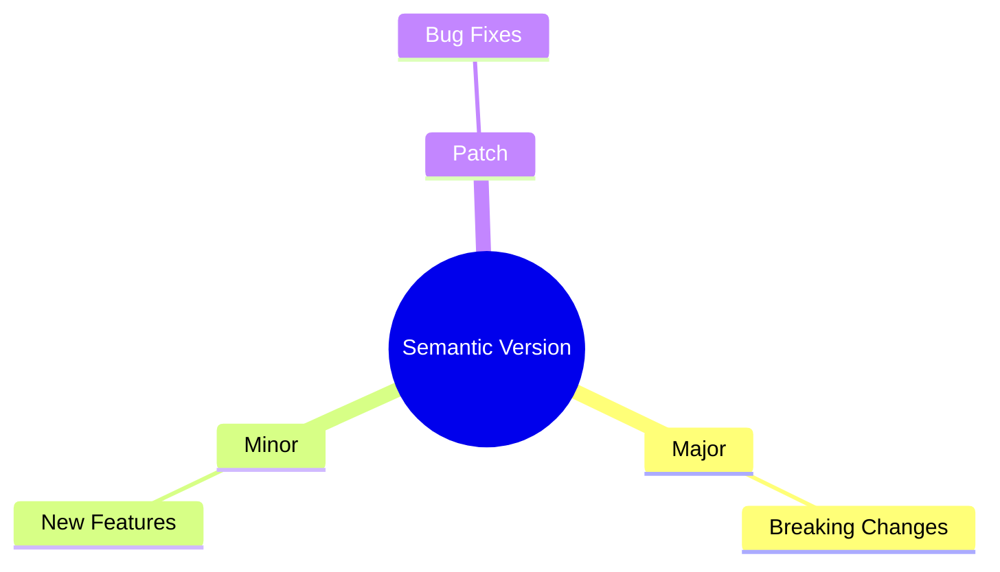

### 2. Processo de Release
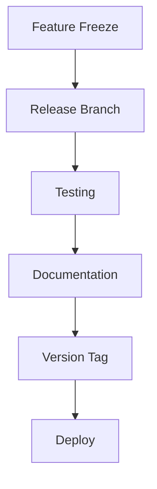

## Automação e Ferramentas

### 1. Stack Essencial
```ascii
🛠️ Essential Tools

Versionamento:
├── Git
└── GitHub/GitLab

CI/CD:
├── Jenkins/GitHub Actions
└── Docker

Qualidade:
├── ESLint/SonarQube
└── Jest/PyTest

Documentação:
├── Markdown
└── Swagger/OpenAPI
```

### 2. Automações Recomendadas
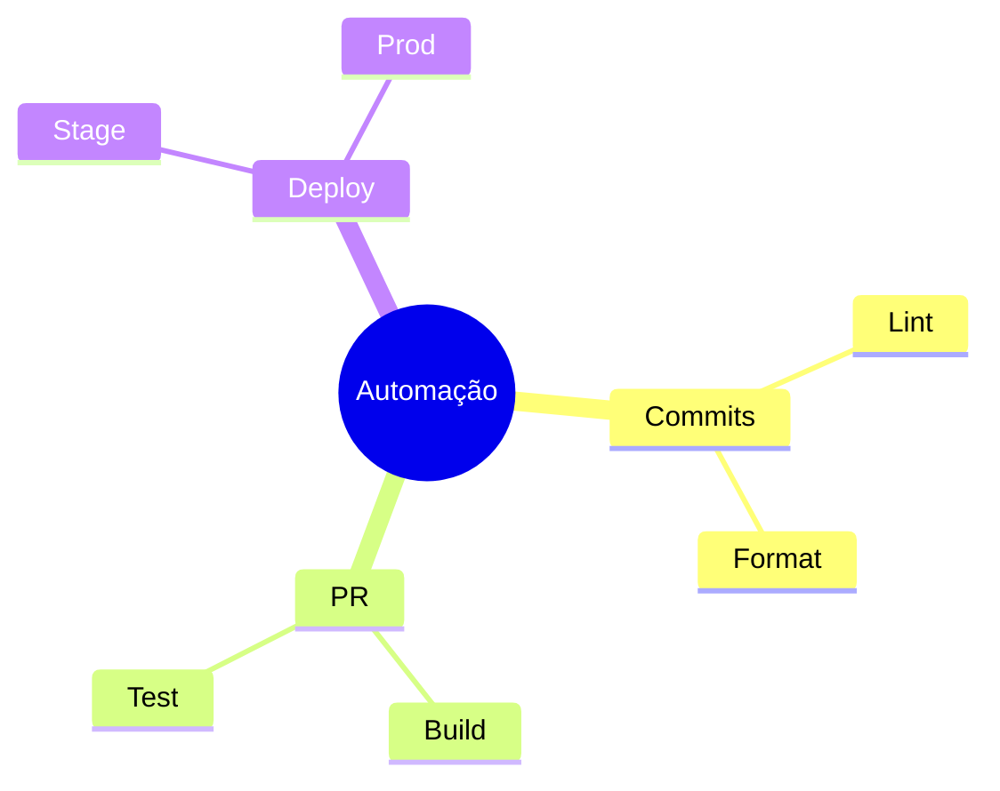

## Resolução de Conflitos

### 1. Prevenção
```ascii
🛡️ Conflict Prevention

1. Pull frequente
2. Branches curtas
3. Comunicação clara
4. Modularização
5. Feature flags
```

### 2. Resolução
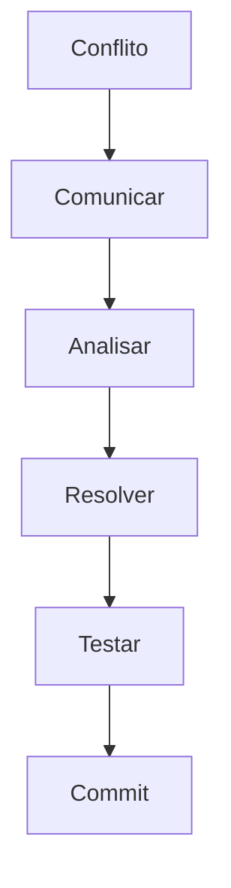

## Métricas e Monitoramento

### 1. KPIs Importantes
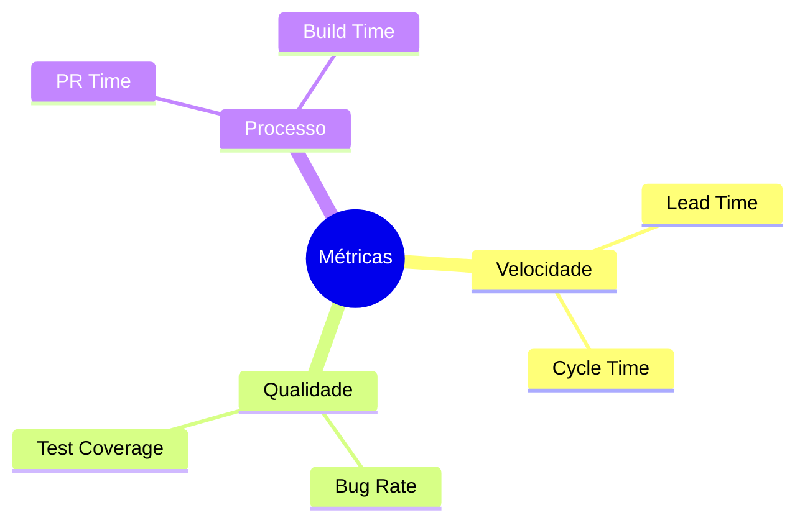

### 2. Checklist de Monitoramento
```ascii
📊 Monitoring Checklist

Daily:
├── Build status
├── Test results
└── PR backlog

Weekly:
├── Code coverage
├── Tech debt
└── Performance

Monthly:
├── Process metrics
└── Team velocity
```

## Dicas de Sucesso

### 1. Para o Time
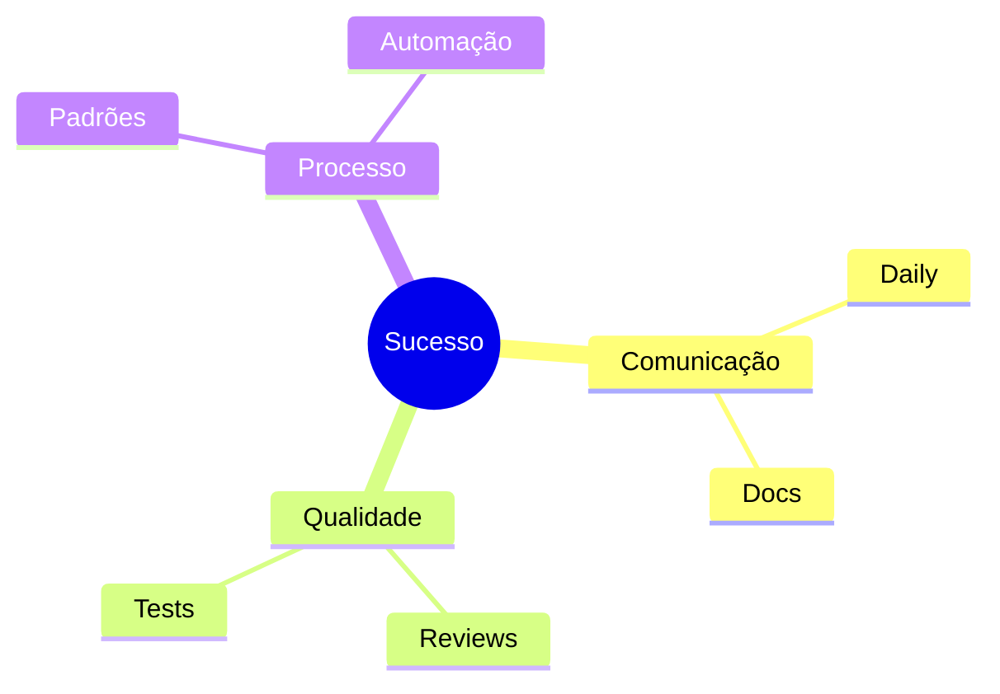

### 2. Checklist Diário
```ascii
📋 Daily Checklist

1. [ ] Pull latest
2. [ ] Check CI/CD
3. [ ] Review PRs
4. [ ] Update docs
5. [ ] Communicate blockers
```

## Conclusão

Como diria o Stifler: "As regras existem pra festa não virar bagunça!" Boas práticas são como as regras da festa - elas garantem que todo mundo se divirta sem criar problemas!

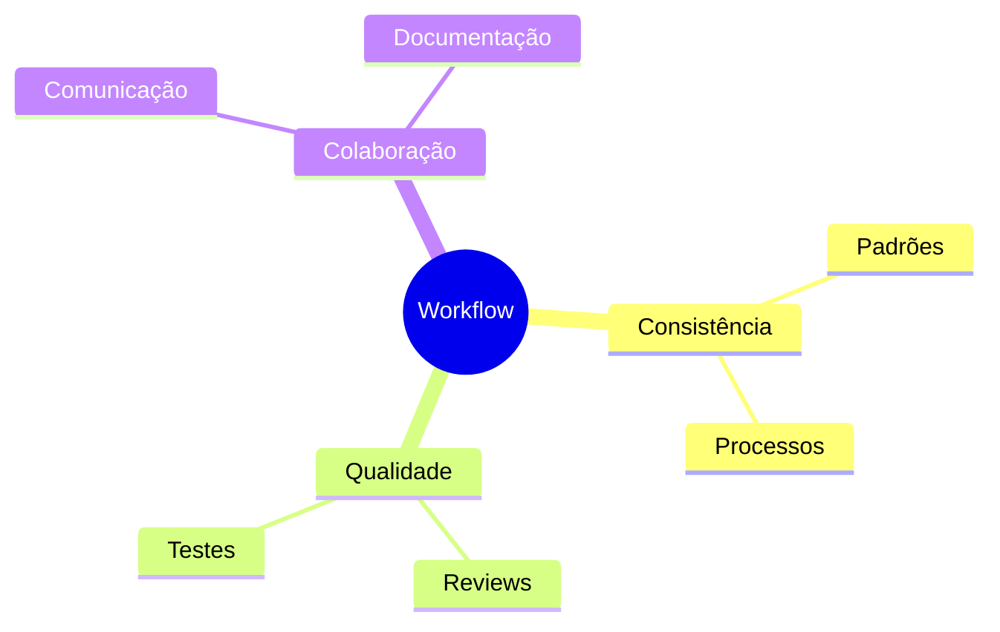