# Comparando Workflows

Se os workflows fossem festas do American Pie, seria assim:
- Trunk-Based: Festa informal na casa do Jim
- Feature Branch: Festa na casa do Stifler
- Gitflow: Baile de formatura
- Fork: Festival com várias stages

## Visão Geral

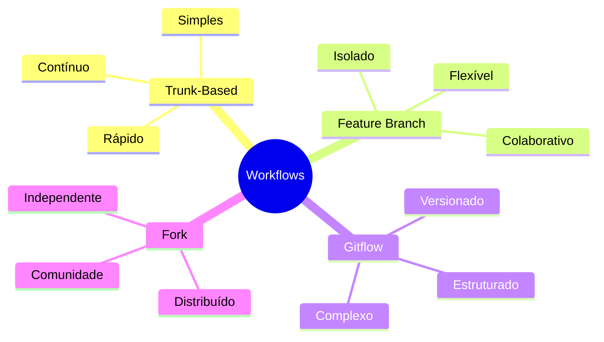

## Comparação Detalhada

### 1. Complexidade vs Flexibilidade
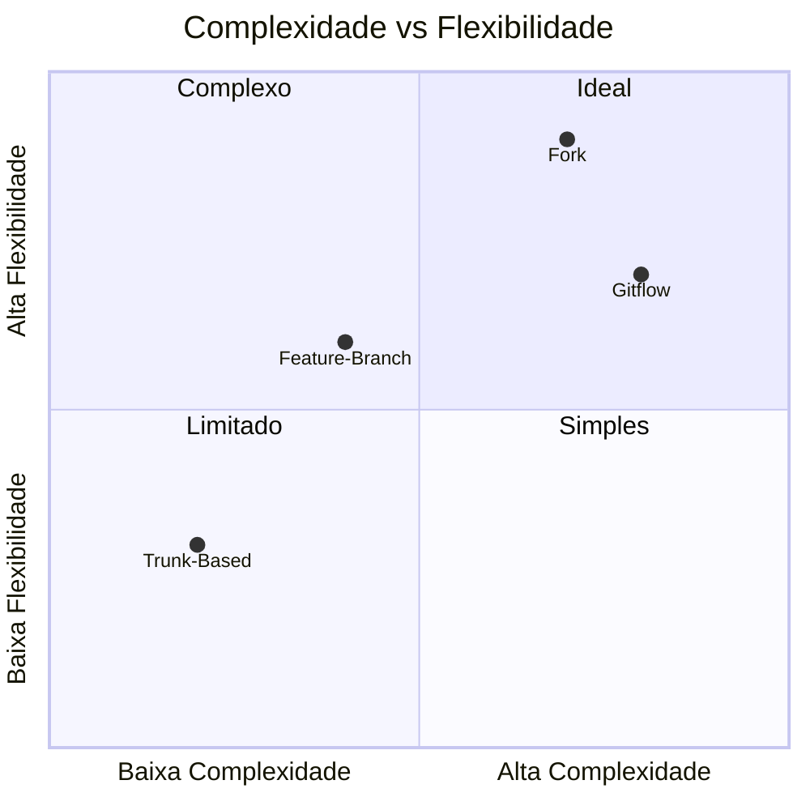

### 2. Tabela Comparativa

| Aspecto | Trunk-Based | Feature Branch | Gitflow | Fork |
|---------|-------------|----------------|---------|------|
| Complexidade | Baixa | Média | Alta | Alta |
| CI/CD | Excelente | Bom | Moderado | Variável |
| Review | Rápido | Bom | Detalhado | Comunitário |
| Releases | Contínuas | Flexíveis | Planejadas | Independentes |
| Time Size | Pequeno | Médio | Grande | Distribuído |

## Cenários de Uso

### 1. Por Tamanho de Projeto
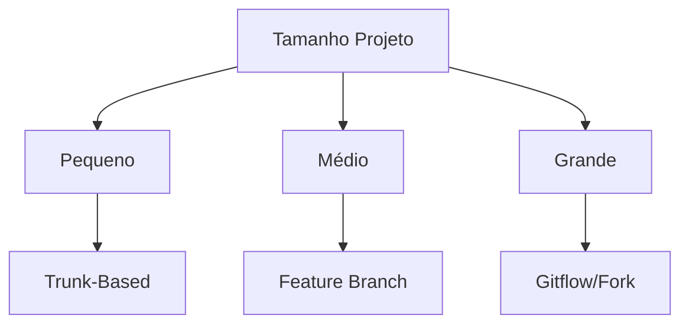

### 2. Por Tipo de Entrega
```ascii
📦 Release Strategy Match

Continuous Delivery
└── Trunk-Based Development

Regular Releases
├── Feature Branch
└── Gitflow

Community/Open Source
└── Fork
```

## Pontos Fortes

### 1. Trunk-Based
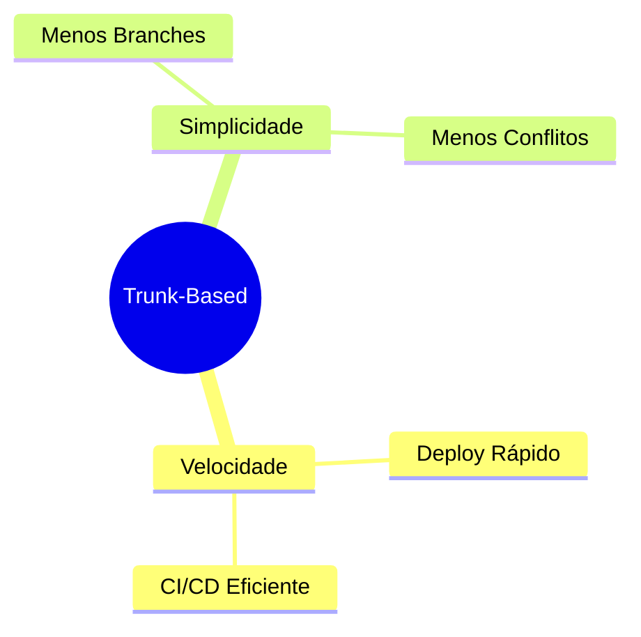

### 2. Feature Branch
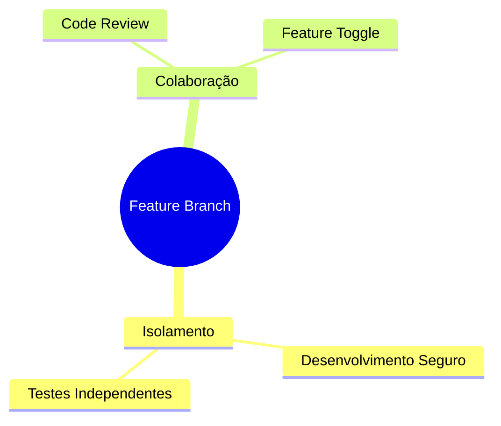

### 3. Gitflow
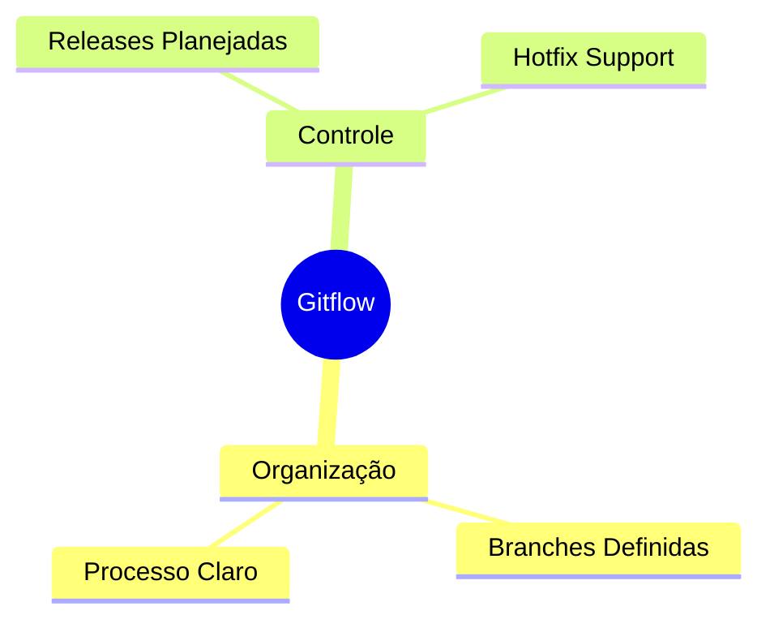

### 4. Fork
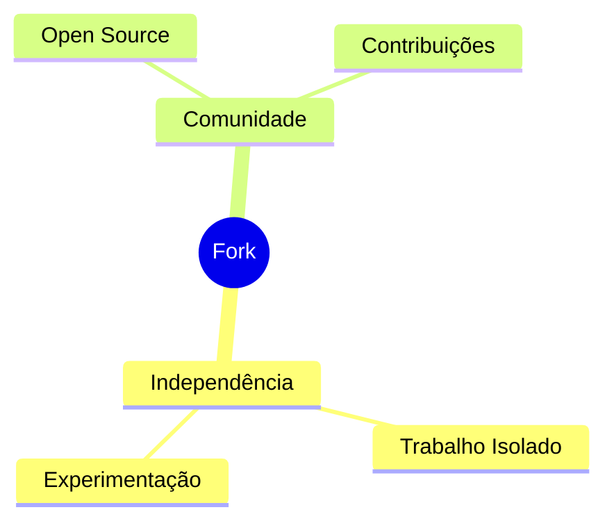

## Desafios Comuns

### 1. Problemas e Soluções
```ascii
🎯 Workflow Challenges

Trunk-Based
├── Qualidade de Código
└── Feature Flags

Feature Branch
├── Long-Living Branches
└── Merge Hell

Gitflow
├── Complexidade
└── Overhead

Fork
├── Sincronização
└── Divergência
```

### 2. Mitigação de Riscos
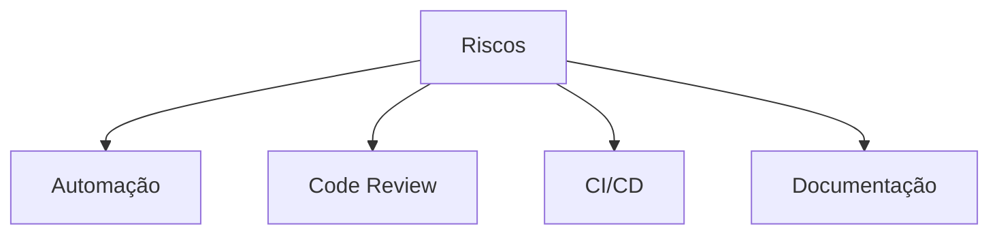

## Escolhendo um Workflow

### 1. Critérios de Decisão
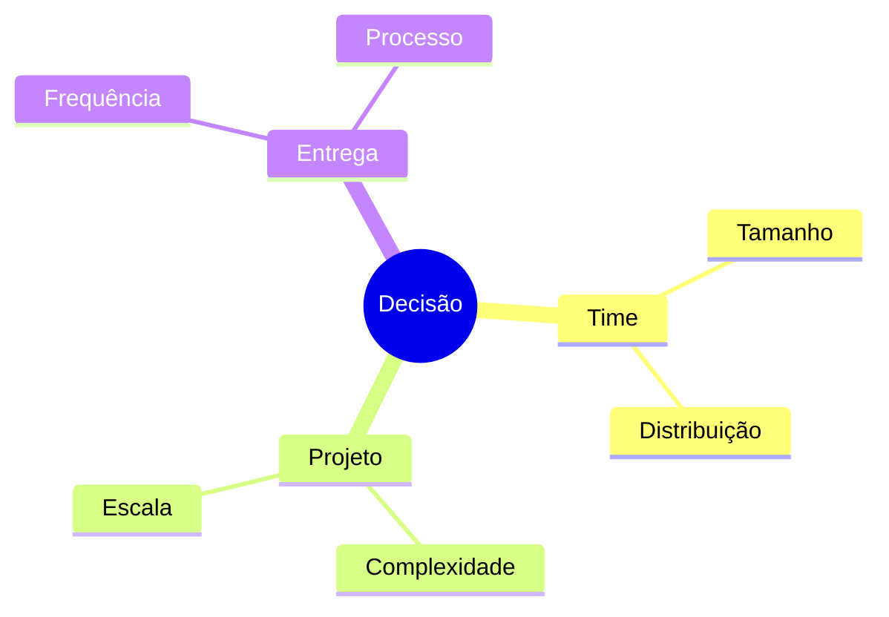

### 2. Matriz de Decisão
```ascii
🎯 Decision Matrix

Small Team + Fast Delivery
└── Trunk-Based

Medium Team + Regular Releases
└── Feature Branch

Large Team + Structured Releases
└── Gitflow

Open Source + Community
└── Fork
```

## Migração entre Workflows

### 1. Processo de Transição
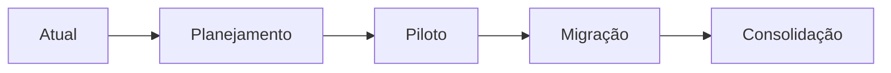

### 2. Checklist de Migração
```ascii
📋 Migration Checklist

1. [ ] Avaliar workflow atual
2. [ ] Definir novo workflow
3. [ ] Treinar equipe
4. [ ] Projeto piloto
5. [ ] Migração gradual
6. [ ] Documentação
7. [ ] Monitoramento
```

## Ferramentas e Automação

### 1. Stack Tecnológica
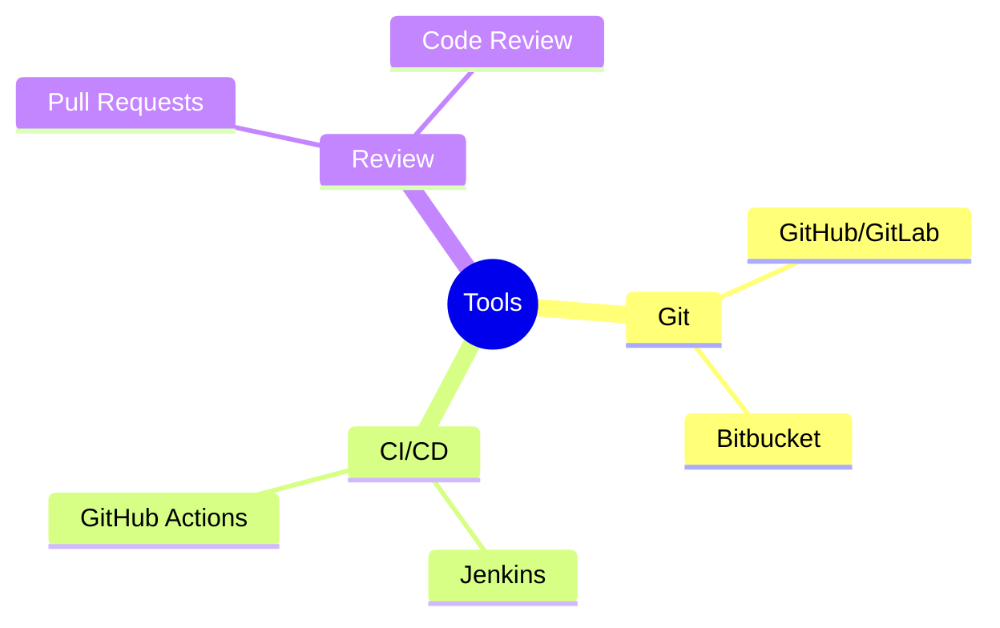

### 2. Automações Essenciais
```ascii
🤖 Automation Must-Haves

CI/CD Pipeline
├── Build
├── Test
└── Deploy

Code Quality
├── Linting
├── Testing
└── Coverage

Branch Protection
├── Reviews
└── Checks
```

## Conclusão

Como escolher entre as festas do American Pie, a escolha do workflow depende do seu "estilo de festa":

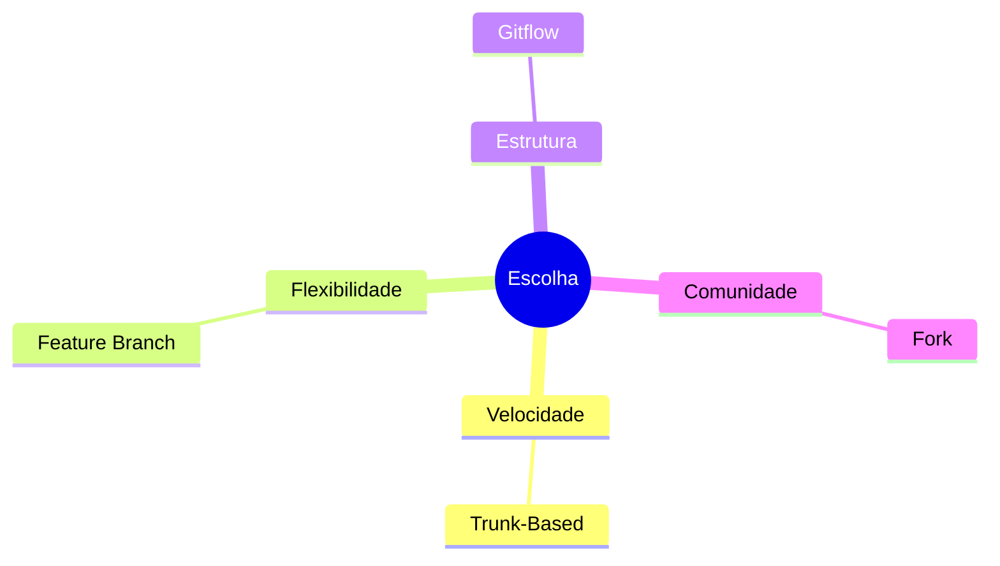

Lembre-se: não existe workflow perfeito, existe o workflow certo para seu contexto. Como diria o Stifler: "A melhor festa é aquela que funciona pro seu grupo!"