# Migração de Workflow

Como mudar de festa sem estragar a diversão? Vamos aprender a migrar entre workflows de forma suave e segura!

## Planejamento da Migração

### 1. Avaliação Inicial
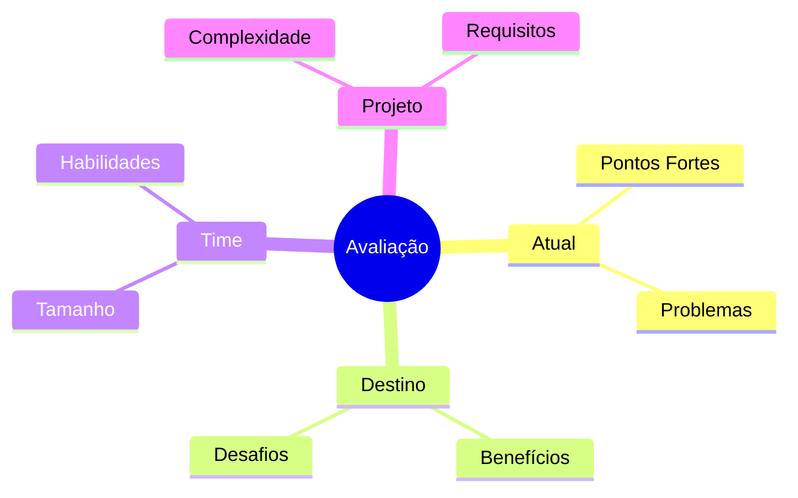

### 2. Matriz de Impacto
```ascii
📊 Impact Matrix

Alto Impacto/Alta Urgência
├── CI/CD Pipeline
└── Branch Strategy

Alto Impacto/Baixa Urgência
├── Code Review Process
└── Release Schedule

Baixo Impacto/Alta Urgência
├── Commit Standards
└── Documentation

Baixo Impacto/Baixa Urgência
├── Tool Updates
└── Optional Features
```

## Estratégias de Migração

### 1. Big Bang vs Gradual
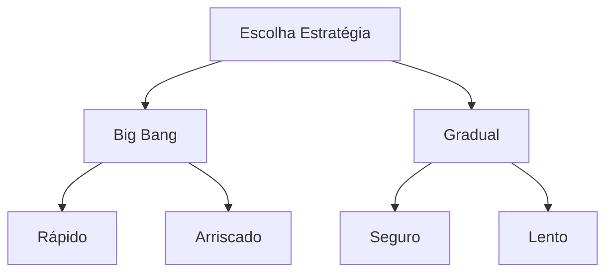

### 2. Abordagem Gradual
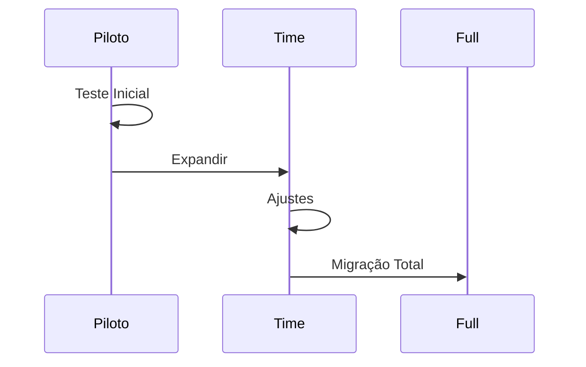

## Plano de Migração

### 1. Fases do Processo
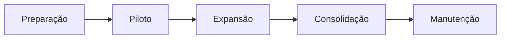

### 2. Checklist por Fase
```ascii
📋 Migration Phases

Preparação:
├── Análise atual
├── Define objetivos
├── Planeja mudanças
└── Prepara docs

Piloto:
├── Seleciona time
├── Implementa teste
├── Coleta feedback
└── Ajusta plano

Expansão:
├── Treina times
├── Migra gradual
├── Monitora
└── Suporte

Consolidação:
├── Valida processo
├── Ajusta final
├── Documenta
└── Celebra
```

## Gestão de Riscos

### 1. Matriz de Riscos
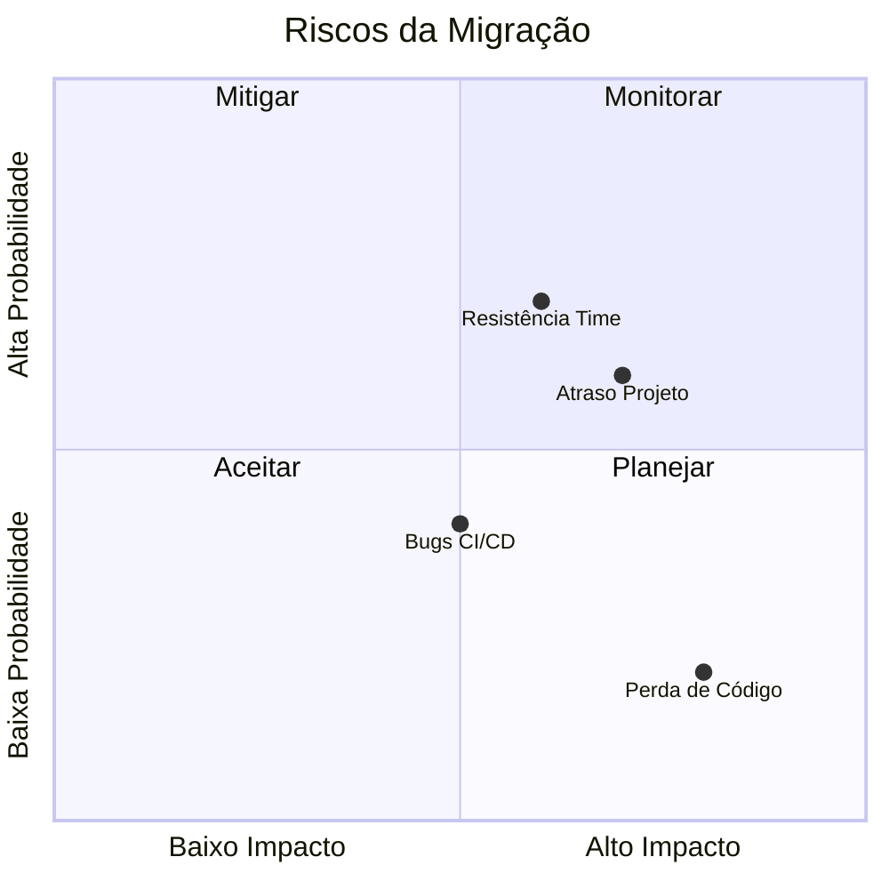

### 2. Plano de Contingência
```ascii
🚨 Contingency Plan

Perda de Código:
├── Backup completo
└── Rollback plan

Resistência Time:
├── Treinamento
└── Suporte dedicado

Bugs CI/CD:
├── Ambiente paralelo
└── Testes extensivos

Atraso Projeto:
├── Buffer timeline
└── Recursos extras
```

## Treinamento e Suporte

### 1. Plano de Capacitação
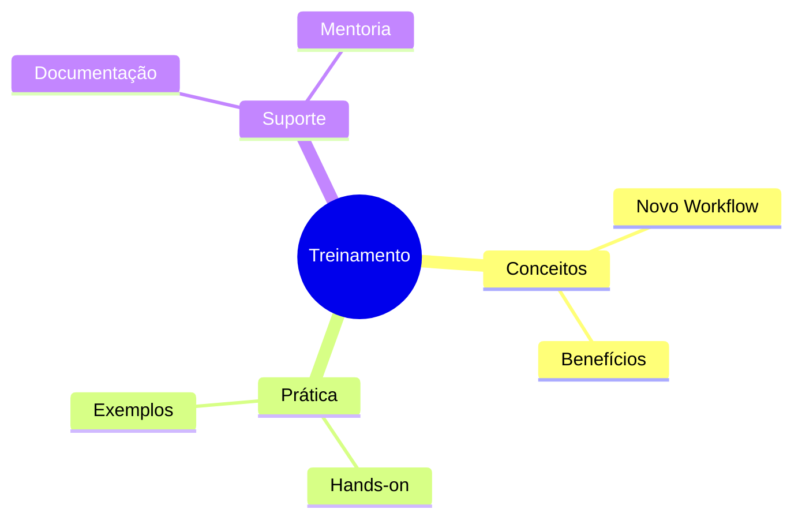

### 2. Material de Apoio
```ascii
📚 Support Material

Documentação:
├── Guias
├── Tutoriais
└── FAQ

Recursos:
├── Vídeos
├── Workshops
└── Templates

Suporte:
├── Chat
├── Office Hours
└── Buddy System
```

## Métricas e Monitoramento

### 1. KPIs de Migração
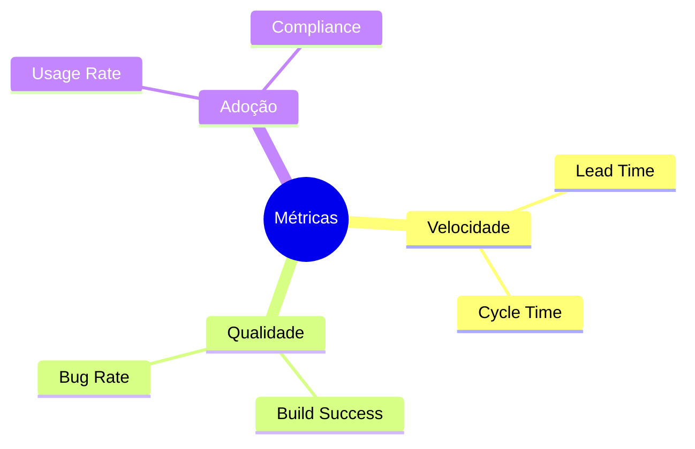

### 2. Dashboard de Acompanhamento
```ascii
📊 Migration Dashboard

Daily Metrics:
├── Build Status
├── PR Flow
└── Issues

Weekly Review:
├── Team Adoption
├── Performance
└── Blockers

Monthly Analysis:
├── Success Rate
├── ROI
└── Satisfaction
```

## Comunicação

### 1. Plano de Comunicação
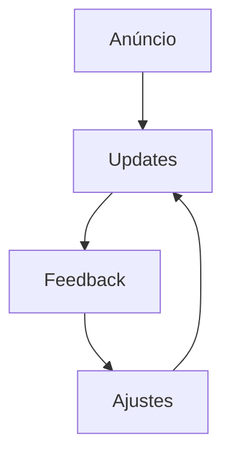

### 2. Canais e Frequência
```ascii
📢 Communication Channels

Daily:
├── Stand-up
└── Chat Updates

Weekly:
├── Team Meeting
└── Progress Report

Monthly:
├── Review
└── Newsletter
```

## Rollback Strategy

### 1. Plano de Reversão
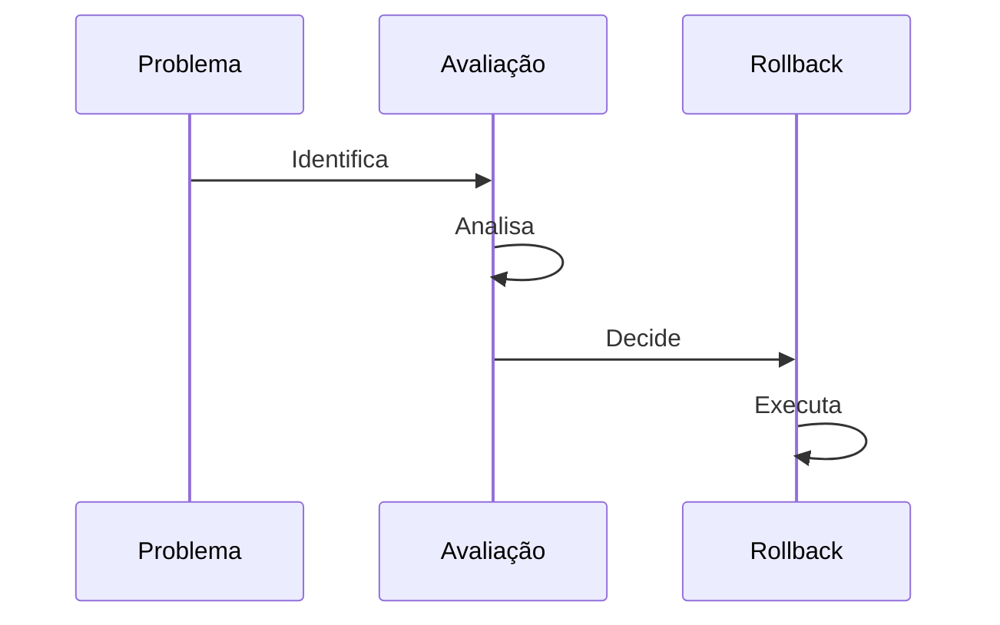

### 2. Checklist de Rollback
```ascii
⏮️ Rollback Checklist

1. [ ] Backup dados
2. [ ] Notifica time
3. [ ] Para processos
4. [ ] Reverte mudanças
5. [ ] Valida sistema
6. [ ] Comunica status
```

## Conclusão

Como diria o Stifler: "Mudar de festa no meio da noite é arriscado, mas com o plano certo, a diversão continua!"

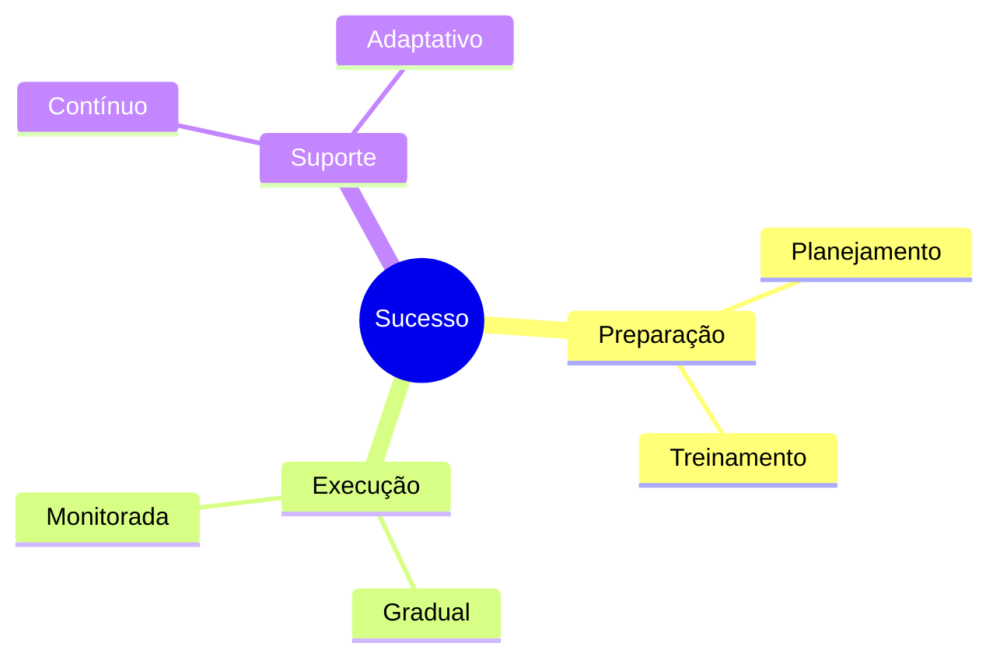

## Dicas Finais

### 1. Do's and Don'ts
```ascii
✅ Do's:
├── Planeje bem
├── Comunique sempre
├── Monitore tudo
└── Celebre conquistas

❌ Don'ts:
├── Pressa excessiva
├── Ignorar feedback
├── Pular testes
└── Esquecer backup
```

### 2. Fatores de Sucesso
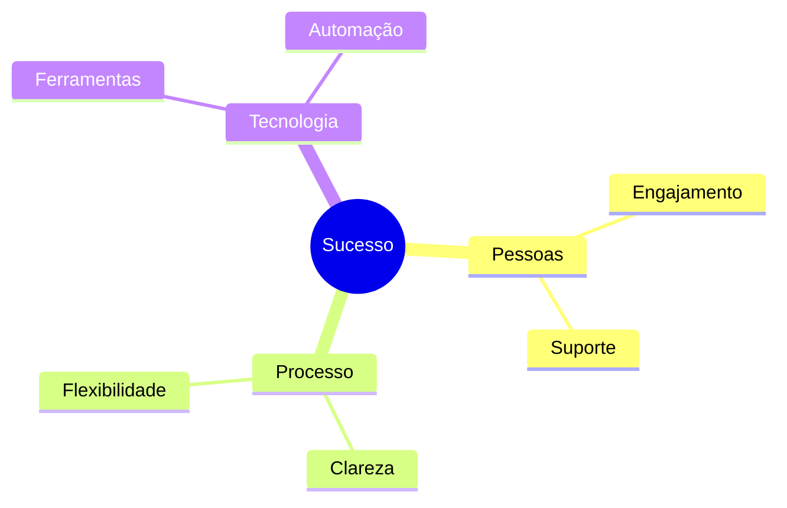